# Civilization 2077
A turn-based mobile game of FreeCiv type, featuring game parameter persistence, user login and account creation, multiplayer support. Players can choose from various nations, allowing for different gameplay strategies. The application also offers features such as buying and sending armies, purchasing gold, and the ability to develop economy and military strength, as well as view individual turns of the gameplay. All of these elements enable full immersion in the game world and strategic focus.

## Tools
The application is built using technologies such as:
- Kotlin
- Jetpack Compose
- Firebase
- following the Material Design guidelines

## Design
We can easily switch between dark mode and light mode.

### Login
Login with email address and password.

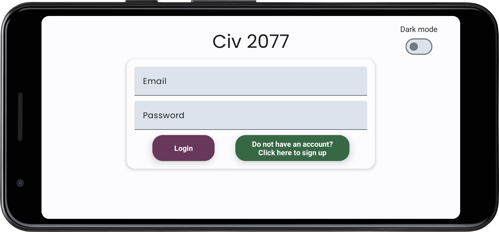
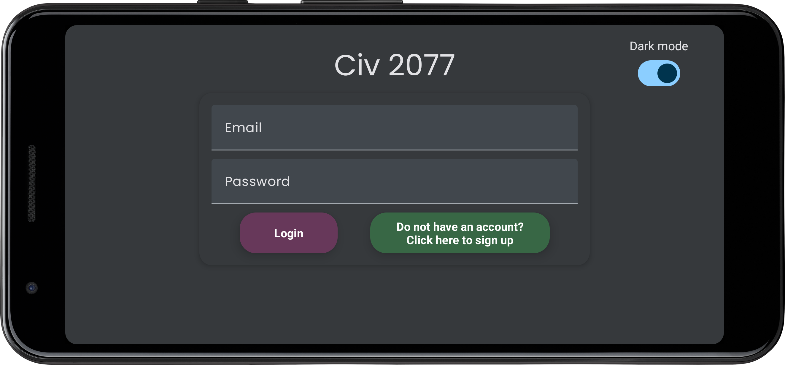

### Sign Up
Create an account by entering your username, email address and password.

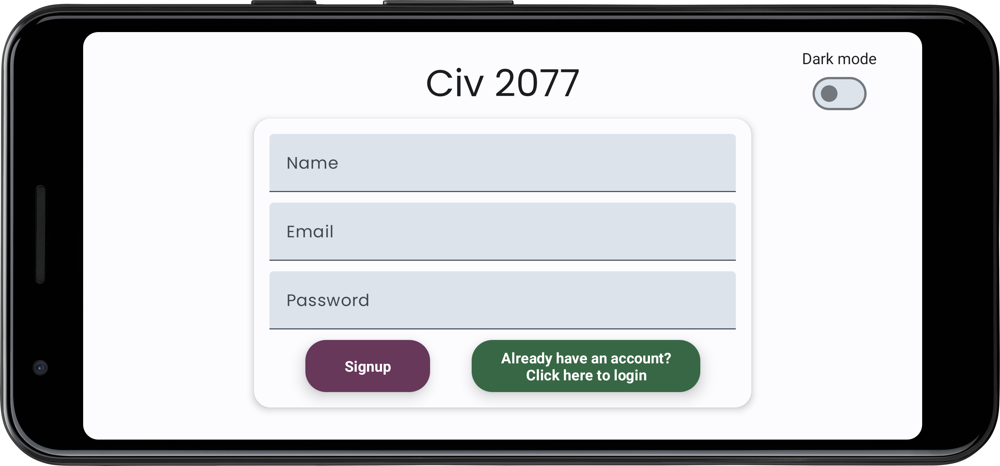
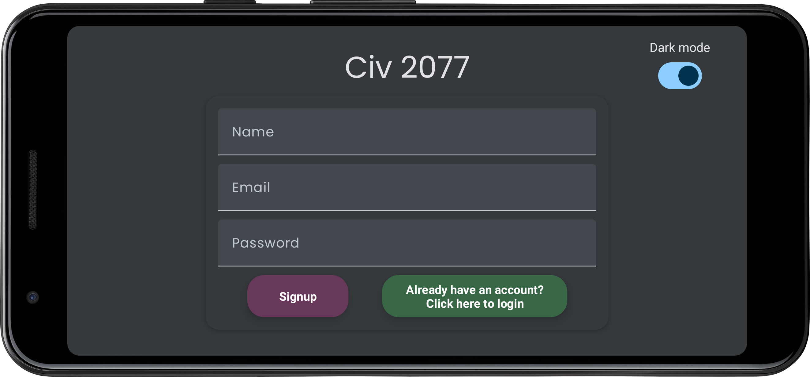

### Home Screen
Here, the user can view their details, change the theme or log out.

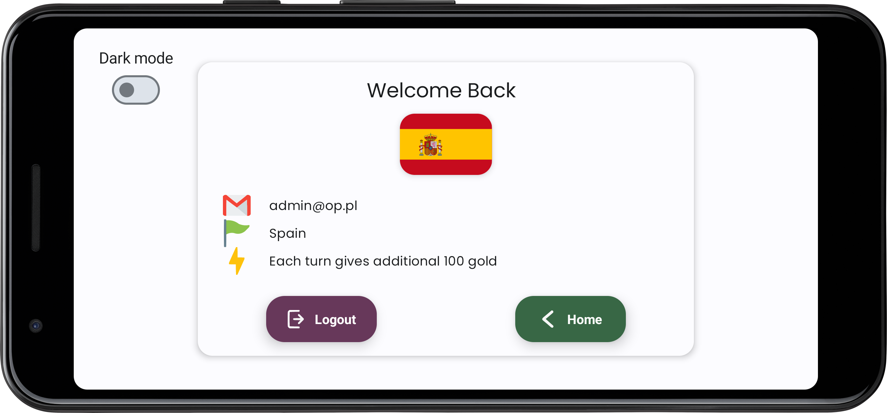
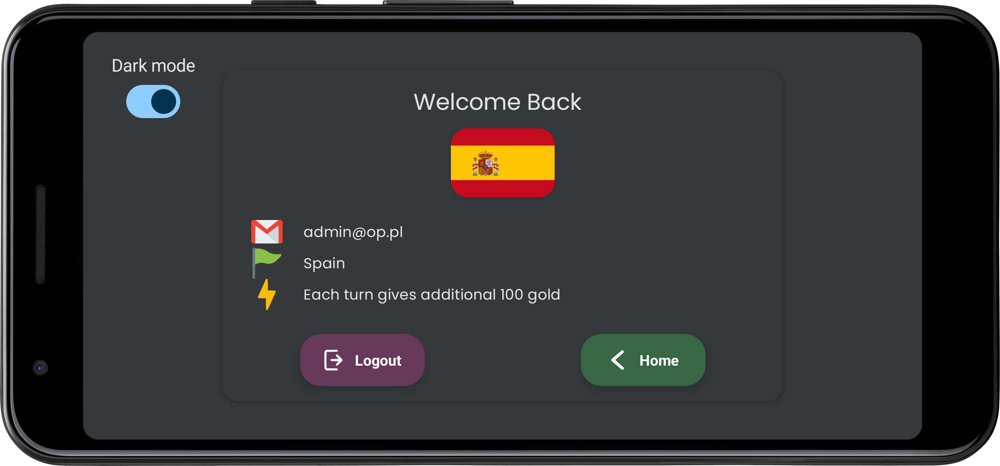

### Buy Gold
The user can buy gold, the price is displayed below (payment methods are currently not available).

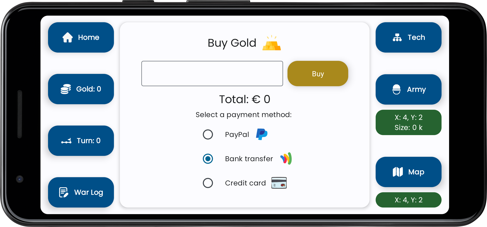
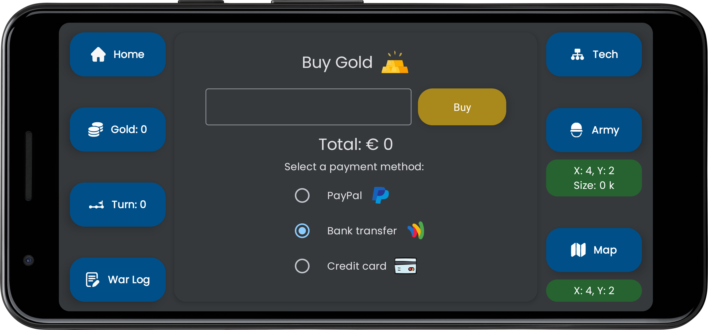

### Turn
The place where the player can see if the others have finished their turns.

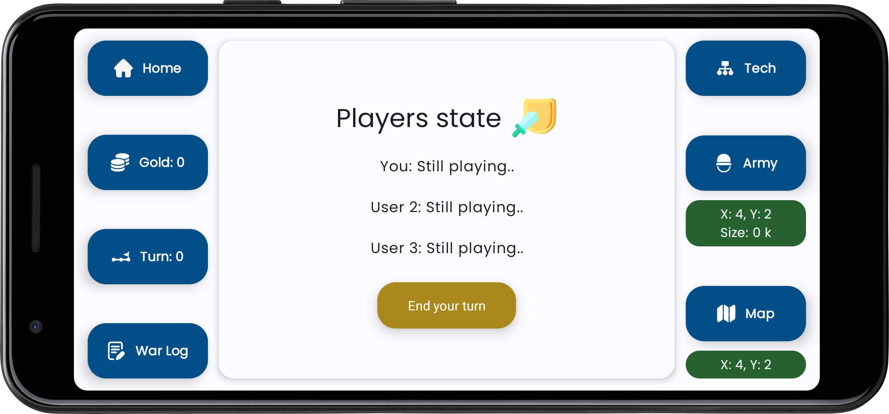
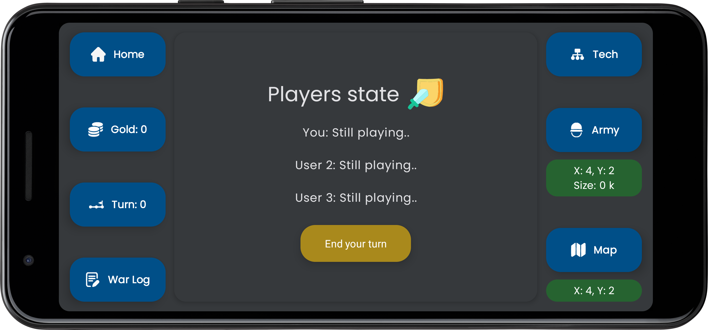

### War Log
Summary of the previous round, including gold and military gains and losses after battles.

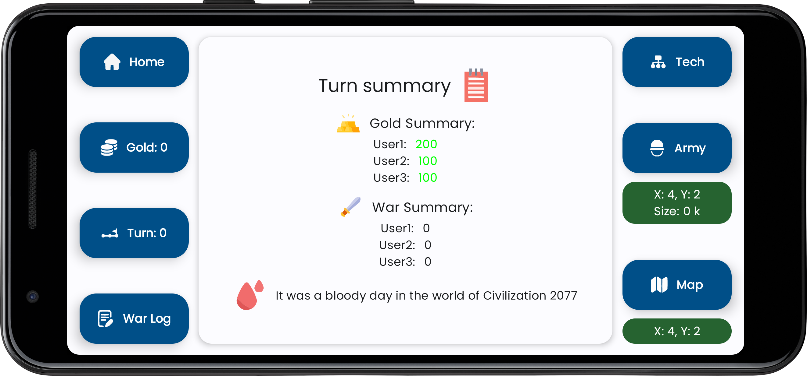
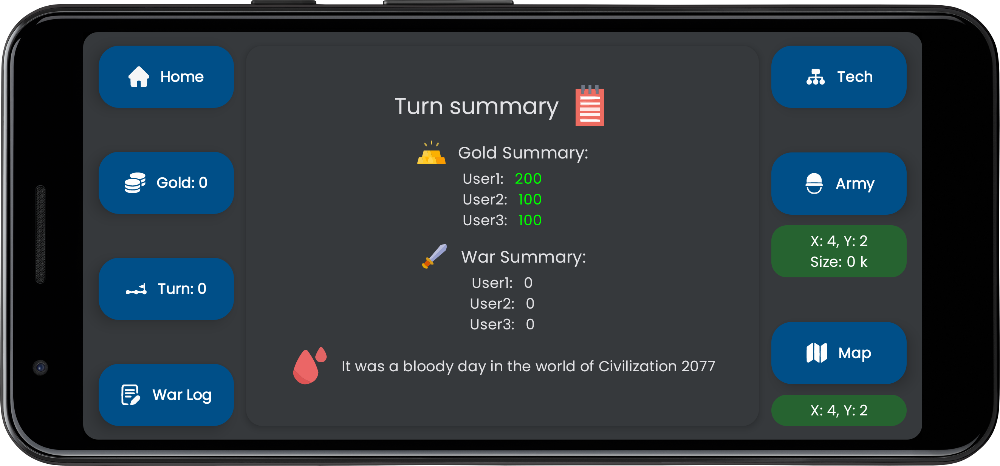

### Tech Tree
Each player has the opportunity to develop their economy and army.

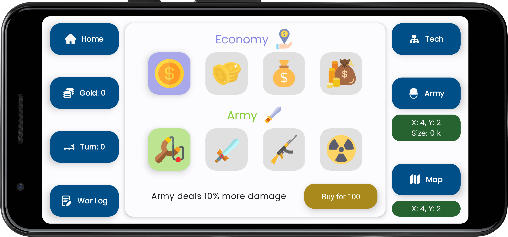
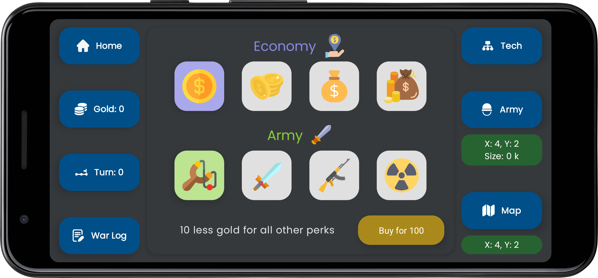

### Buy & Send Army
The player buys units, sends troops to the appropriate coordinates - if they meet with the enemy's troops or with the enemy's base, then a battle takes place.

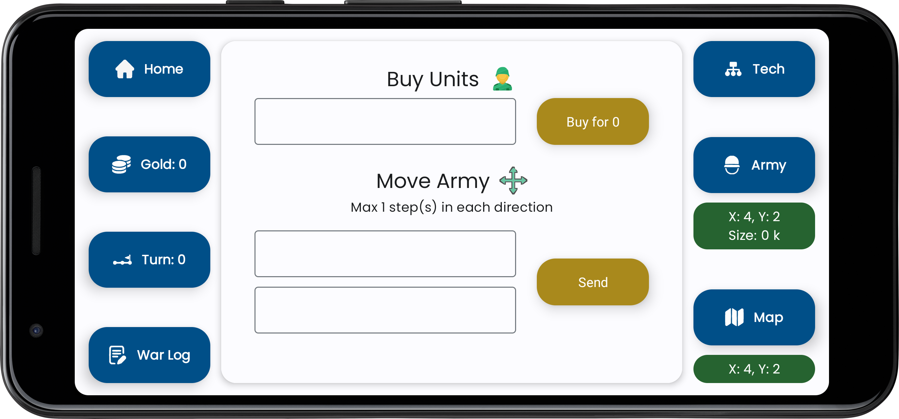
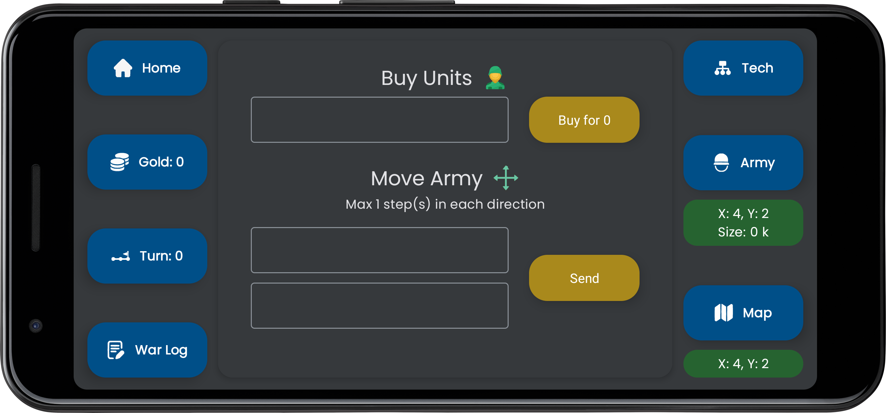

### Map
We have the ability to view the map with the bases.

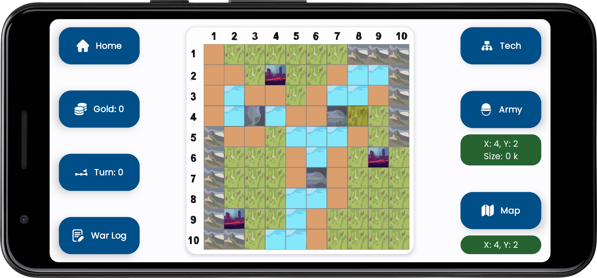
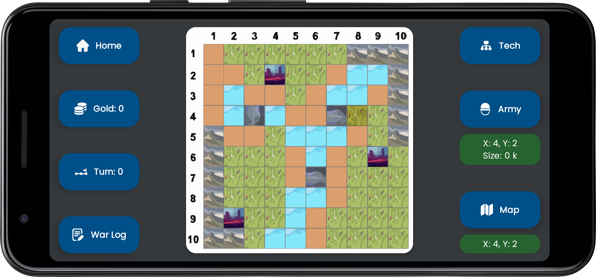

